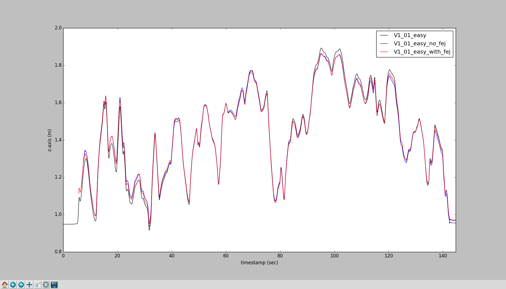
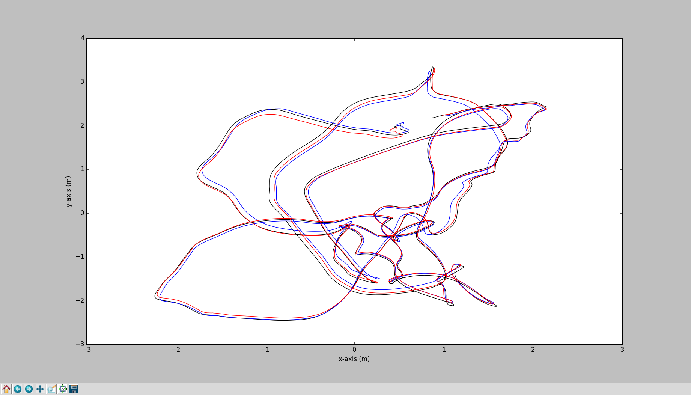

# ov_eval

ov_eval 中评估工具的简单用法说明

> 阅读之前应该先过一遍[1]，并且最好将轨迹数据组织成 [1] 中建议的形式，不然 error_* 几个包用起来会比较麻烦

## pose_to_file

作用：收集算法计算结果存储到 txt 文件中

订阅算法输出位姿的 topic 转成 asl 格式存储，目前支持的 topic 消息类型包括：`PoseWithCovarianceStamped`, `PoseStamped`, `TransformStamped`, `Odometry`

usage:

```xml
<node name="recorder_estimate" pkg="ov_eval" type="pose_to_file" output="screen">
    <param name="topic"      type="str" value="/ov_msckf/poseimu" />
    <param name="topic_type" type="str" value="PoseWithCovarianceStamped" />
    <param name="output"     type="str" value="/home/user/data/traj_log.txt" />
</node>
```

## format_converter

作用：将 csv 格式的 ground truth 转成 txt 格式存储（直接提取 csv 文件的前八个字段，一般是 time(ns),px,py,pz,qw,qx,qy,qz，转成 time(s) x y z qx qy qz qw）

目前不支持指定输出文件名

usage:

```sh
rosrun ov_eval format_convert <file.csv>
rosrun ov_eval format_convert <folder>
```

## error_comparison

作用：读取每个 algo 在各个 dataset 中的多次运行结果，分别计算 ATE 和 RPE 并进行平均以减少算法随机性的影响

```fake
# 伪代码
for (algo: folder_algorithms):
  for (datasets: folder_groundtruth):
    for (entry: est_runs):
      calc ATE, RPE for this run
    calc avg ATE, RPE
    plot RPE
```

usage:

```sh
rosrun ov_eval error_comparison <align_mode> <folder_groundtruth> <folder_algorithms>
```

example:

这里图方便，用的数据是 [plot_trajectories](#plot_trajectories) example 中不同参数配置运行两次的轨迹数据，实际使用时应该是算法相同参数配置的多次运行结果，然后计算算法在不同数据集上的平均 ATE 和 RPE

```plain
#:~/workspace/evaluation$ rosrun ov_eval error_comparison se3 truth/ algorithm/
[ INFO] [1576766051.044753308]: [COMP]: 2895 poses in V1_01_easy.txt => length of 88.86 meters
[ INFO] [1576766051.044834098]: ======================================
[ INFO] [1576766051.044844135]: [COMP]: processing openvins algorithm
[ INFO] [1576766051.044866408]: [COMP]: processing openvins algorithm => V1_01_easy dataset
[ INFO] [1576766051.062312797]: [TRAJ]: q_ESTtoGT = -0.002, -0.007, 0.012, 1.000 | p_ESTinGT = -0.057, -0.006, 0.061 | s = 1.00
[ INFO] [1576766051.113728335]: [TRAJ]: q_ESTtoGT = -0.001, -0.003, 0.006, 1.000 | p_ESTinGT = -0.001, 0.017, 0.032 | s = 1.00
[ INFO] [1576766051.150436822]: 	ATE: mean_ori = 0.789 | mean_pos = 0.064
[ INFO] [1576766051.150457502]: 	ATE: std_ori  = 0.344 | std_pos  = 0.015
[ INFO] [1576766051.150875183]: 	RPE: seg 8 - median_ori = 0.5668 | median_pos = 0.0733 (5056 samples)
[ INFO] [1576766051.151253228]: 	RPE: seg 16 - median_ori = 0.6465 | median_pos = 0.0802 (4762 samples)
[ INFO] [1576766051.151601656]: 	RPE: seg 24 - median_ori = 0.6177 | median_pos = 0.0798 (4532 samples)
[ INFO] [1576766051.151922544]: 	RPE: seg 32 - median_ori = 0.6442 | median_pos = 0.0803 (4248 samples)
[ INFO] [1576766051.152224301]: 	RPE: seg 40 - median_ori = 0.5605 | median_pos = 0.0793 (4056 samples)
[ INFO] [1576766051.152525008]: 	RPE: seg 48 - median_ori = 0.6697 | median_pos = 0.0992 (4002 samples)
[ INFO] [1576766051.152628426]: ============================================
[ INFO] [1576766051.152639002]: ATE LATEX TABLE
[ INFO] [1576766051.152647772]: ============================================
 & \textbf{V1\_01\_easy} & \textbf{Average} \\\hline
openvins & 0.825 / 0.065 & 0.825 / 0.065 \\
[ INFO] [1576766051.152724334]: ============================================
[ INFO] [1576766051.152748060]: ============================================
[ INFO] [1576766051.152755649]: RPE LATEX TABLE
[ INFO] [1576766051.152763121]: ============================================
 & \textbf{8m} & \textbf{16m} & \textbf{24m} & \textbf{32m} & \textbf{40m} & \textbf{48m} \\\hline
openvins & 0.567 / 0.073 & 0.647 / 0.080 & 0.618 / 0.080 & 0.644 / 0.080 & 0.561 / 0.079 & 0.670 / 0.099 \\
[ INFO] [1576766051.154778380]: ============================================
```


## error_dataset

作用：读取每个 algo 在数据集 file_gt 上的多次运行结果，计算平均 RMSE, NEES 并 plot 出来

```fake
# 伪代码
for (algo: folder_algorithms):
  for (entry: file_gt_est_runs):
    calc ATE, RMSE, NEES, RPE for this run
  calc avg ATE, RMSE, NEES, RPE
```

usage:

```sh
rosrun ov_eval error_dataset <align_mode> <file_gt.txt> <folder_algorithms>
```

example:

```plain
#:~/workspace/evaluation$ rosrun ov_eval error_dataset se3 truth/V1_01_easy.txt algorithm/
[ INFO] [1576770212.761728847]: [COMP]: 2895 poses in V1_01_easy => length of 88.86 meters
[ INFO] [1576770212.761802180]: ======================================
[ INFO] [1576770212.761811845]: [COMP]: processing openvins algorithm
[ INFO] [1576770212.778955461]: [TRAJ]: q_ESTtoGT = -0.002, -0.007, 0.012, 1.000 | p_ESTinGT = -0.057, -0.006, 0.061 | s = 1.00
[ INFO] [1576770212.824914368]: [TRAJ]: q_ESTtoGT = -0.001, -0.003, 0.006, 1.000 | p_ESTinGT = -0.001, 0.017, 0.032 | s = 1.00
[ INFO] [1576770212.854617295]: 	ATE: mean_ori = 0.789 | mean_pos = 0.064
[ INFO] [1576770212.854633071]: 	ATE: std_ori  = 0.34366 | std_pos  = 0.01492
[ INFO] [1576770212.855156461]: 	RPE: seg 7 - mean_ori = 0.625 | mean_pos = 0.079 (5056 samples)
[ INFO] [1576770212.855710004]: 	RPE: seg 14 - mean_ori = 0.703 | mean_pos = 0.089 (4866 samples)
[ INFO] [1576770212.856209657]: 	RPE: seg 21 - mean_ori = 0.648 | mean_pos = 0.082 (4562 samples)
[ INFO] [1576770212.856619918]: 	RPE: seg 28 - mean_ori = 0.788 | mean_pos = 0.086 (4404 samples)
[ INFO] [1576770212.856968166]: 	RPE: seg 35 - mean_ori = 0.806 | mean_pos = 0.081 (4114 samples)
[ INFO] [1576770212.857712285]: 	RMSE: mean_ori = 0.785 | mean_pos = 0.062
[ INFO] [1576770212.858345127]: 	NEES: mean_ori = 249.988 | mean_pos = 3.516
[ INFO] [1576770213.600225289]: ============================================
```


## error_singlerun

作用：计算算法单次运行的 ATE, RPE, RMSE, NEES, pose error(3$\sigma$) 并 plot 出来

usage:

```sh
rosrun ov_eval error_singlerun <align_mode> <file_gt.txt> <file_est.txt>
```

example:

```plain
#:~/workspace/evaluation$ rosrun ov_eval error_singlerun se3 truth/V1_01_easy.txt algorithm/openvins/V1_01_easy/V1_01_easy_with_fej.txt [ INFO] [1576771884.967577101]: [COMP]: 2895 poses in V1_01_easy => length of 88.86 meters
[ INFO] [1576771884.986044187]: [TRAJ]: q_ESTtoGT = -0.001, -0.003, 0.006, 1.000 | p_ESTinGT = -0.001, 0.017, 0.032 | s = 1.00
[ INFO] [1576771884.987516831]: ======================================
[ INFO] [1576771884.987530199]: Absolute Trajectory Error
[ INFO] [1576771884.987537555]: ======================================
[ INFO] [1576771884.987545627]: rmse_ori = 0.546 | rmse_pos = 0.053
[ INFO] [1576771884.987552179]: mean_ori = 0.500 | mean_pos = 0.049
[ INFO] [1576771884.987562900]: min_ori  = 0.088 | min_pos  = 0.007
[ INFO] [1576771884.987587484]: max_ori  = 1.170 | max_pos  = 0.114
[ INFO] [1576771884.987614409]: std_ori  = 0.219 | std_pos  = 0.021
[ INFO] [1576771885.016880370]: ======================================
[ INFO] [1576771885.016918771]: Relative Pose Error
[ INFO] [1576771885.016927608]: ======================================
[ INFO] [1576771885.016958790]: seg 8 - median_ori = 0.477 | median_pos = 0.061 (2537 samples)
[ INFO] [1576771885.016967589]: seg 16 - median_ori = 0.490 | median_pos = 0.063 (2390 samples)
[ INFO] [1576771885.016973352]: seg 24 - median_ori = 0.401 | median_pos = 0.055 (2275 samples)
[ INFO] [1576771885.016991515]: seg 32 - median_ori = 0.524 | median_pos = 0.068 (2133 samples)
[ INFO] [1576771885.016996569]: seg 40 - median_ori = 0.485 | median_pos = 0.072 (2037 samples)
[ INFO] [1576771885.738522828]: ======================================
[ INFO] [1576771885.738555197]: Normalized Estimation Error Squared
[ INFO] [1576771885.738569322]: ======================================
[ INFO] [1576771885.738587745]: mean_ori = 116.577 | mean_pos = 2.144
[ INFO] [1576771885.738601671]: min_ori  = 0.133 | min_pos  = 0.032
[ INFO] [1576771885.738615847]: max_ori  = 602.480 | max_pos  = 8.555
[ INFO] [1576771885.738630077]: std_ori  = 105.535 | std_pos  = 1.730
[ INFO] [1576771885.738642262]: ======================================
```


## error_simulation

TODO: simulation run 还没看

usage:

```sh
rosrun ov_eval error_simulation <file_est.txt> <file_std.txt> <file_gt.txt>
```

## timing_singlerun

作用：将 pid_ros.py 记录的 node 资源占用情况 plot 出来

usage:

```sh
rosrun ov_eval timing_singlerun <file_times.txt>
```

example:

```plain
#:~/workspace/evaluation$ rosrun ov_eval timing_singlerun algorithm/openvins/V1_01_easy/time_12201241.txt 
[ INFO] [1576774538.772421057]: [TIME]: loaded 46 timestamps from file!!
```


## timing_comparison

TODO: 还没用过，看代码应该是读取多个 algo 的多次运行结果并计算平均资源占用

usage:

```sh
rosrun ov_eval timing_comparison <timings_folder>
```

## plot_trajectories

作用：将 ground truth 与 file_est 轨迹对齐之后把轨迹 plot 出来，目前是两个 2d 图（x-y, t-z）

usage:

```sh
rosrun ov_eval plot_trajectories <align_mode> <file_gt.txt> <file_est1.txt> ...  <file_est9.txt>
```

看代码目前应该只支持 5 个 file_est，因为画路径的颜色只定义了 6 种。。

align_mode:

1. posyaw
2. posyawsingle
3. se3
4. se3single
5. sim3
6. none：Identity

example:





## reference

1. [Estimator Evaluation Methods](https://docs.openvins.com/evaluation.html)
